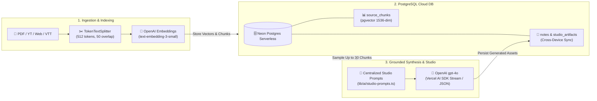
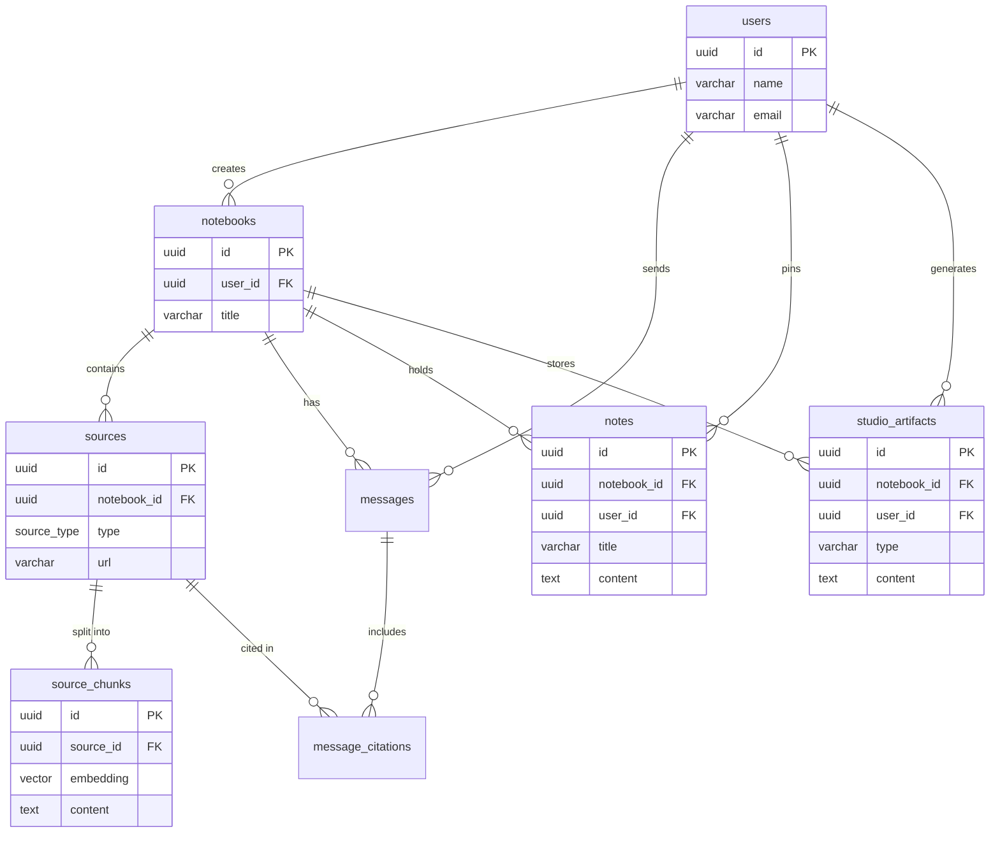

# SourceMind (ChaibookLM)

SourceMind is an enterprise-grade AI personal knowledge base, Notebook Studio, and grounded chat assistant, heavily inspired by Google's NotebookLM. It allows users to upload unstructured data (PDFs, YouTube videos, web pages, plain text, and VTT transcripts), index them via a multi-modal Retrieval-Augmented Generation (RAG) pipeline, synthesize interactive learning artifacts, and draft documents with real-time cloud synchronization.

---

## 🌟 Key Features

### 1. 💬 Grounded AI Assistant with Interactive Citations
- **Semantic Retrieval**: Queries are vectorized and matched against high-dimensional embeddings using PostgreSQL `pgvector`.
- **Zero Hallucination Guardrails**: Strict refusal detection prevents citing sources when context is insufficient.
- **Interactive Citations**: Hovering or clicking bracketed citations (`[1]`, `[2]`) highlights exact excerpts and page numbers in the split-screen source viewer.

### 2. ✨ Notebook Studio & AI Generators
Transform your unstructured sources into testable study aids and strategic briefings with one click:
- **Interactive 3D Flashcards**: Flip animation deck with progress tracking ("Mastered" vs "Need Practice") and reshuffling controls.
- **Self-Assessment Quiz**: 5-question multiple-choice interactive quiz player with instant visual feedback and comprehensive explanation reveals.
- **Study Guide & FAQ**: Auto-generates structured executive summaries, core definitions, and top FAQs.
- **Executive Briefing**: Synthesizes high-level strategic takeaways and actionable insights.

### 3. 📝 Pinned Notes & AI Drafting Assistant
- **Cloud-Synchronized Scratchpad**: Pin AI responses or create custom notes. Synchronized across devices via PostgreSQL and Drizzle ORM with optimistic local caching.
- **AI Drafting Assistant**: Select pinned notes and choose a drafting template (**Blog Post**, **Analytical Report**, **Email Summary**, or **Custom Prompt**) to synthesize polished documents.

---

## 🛠️ Tech Stack

### Frontend


- **Framework**: [Next.js](https://nextjs.org/) 16 (App Router, Turbopack, React 19)
- **Styling**: [Tailwind CSS v4](https://tailwindcss.com/) & [shadcn/ui](https://ui.shadcn.com/)
- **API Fetching**: `axios` with custom JWT Bearer interception
- **Markdown & Code**: `react-markdown` with `remark-gfm`

### Backend and Database


- **Database**: [Neon Postgres Serverless](https://neon.tech/) with `pgvector`
- **ORM**: [Drizzle ORM](https://orm.drizzle.team/)
- **Authentication**: JWT-based custom authentication (bcryptjs, jsonwebtoken)

### AI and RAG Pipeline


- **Generative AI SDK**: [Vercel AI SDK](https://sdk.vercel.ai/docs) (`ai`, `@ai-sdk/openai`, `@ai-sdk/google`)
- **Embeddings**: OpenAI's `text-embedding-3-small` (1536 dimensions)
- **Chunking**: `@langchain/textsplitters` (`TokenTextSplitter` with `cl100k_base` encoding)
- **Data Loaders**: `pdfjs-dist`, `youtube-transcript`, `cheerio`

---

## 🏗️ RAG & Studio Architecture



---

## 🗄️ Database Schema (ER Diagram)

All user notes, flashcard decks, quizzes, and chat messages are persisted in PostgreSQL using Drizzle ORM, ensuring 100% cloud accessibility across devices.



---

## 📁 Folder Structure

```
.
├── app/
│   ├── api/                      # Next.js API Route Handlers (Backend)
│   │   ├── auth/                 # Login, Signup, and Me routes
│   │   └── notebooks/            # Notebook CRUD endpoints
│   │       ├── [id]/chat/        # RAG Chat & Streaming Citations
│   │       ├── [id]/sources/     # Multi-Modal Source Ingestion
│   │       ├── [id]/studio/      # Studio Generators & DB Persistence
│   │       └── [id]/notes/       # Cloud-Synchronized Pinned Notes CRUD
│   ├── dashboard/                # Dashboard UI for managing notebooks
│   ├── login/ & signup/          # Authentication pages
│   └── notebook/[id]/            # Main Workspace (Chat, Studio, Notes, Viewer tabs)
├── components/
│   ├── notebook/                 # Core Workspace UI components
│   │   ├── chat-panel.tsx        # Grounded Chat with Auto-Scroll & Citations
│   │   ├── studio-panel.tsx      # Hub, 3D Flashcards, Quiz Player, Study Guides
│   │   ├── notes-panel.tsx       # Pinned Notes Scratchpad & AI Drafting Assistant
│   │   └── source-viewer.tsx     # Split-screen highlighter & source inspector
│   └── ui/                       # Reusable shadcn/ui components
├── lib/
│   ├── ai/                       # RAG & Prompt engineering modules
│   │   ├── studio-prompts.ts     # Decoupled prompt generator for Studio & Drafting
│   │   ├── chunker.ts            # LangChain token splitter
│   │   └── loaders.ts            # PDF, YouTube, and HTML scrapers
│   ├── db/                       # Neon Serverless connection & Drizzle ORM schema
│   ├── notes-util.ts             # Axios DB sync & optimistic localStorage fallback
│   ├── auth.ts                   # JWT utilities
│   └── store.tsx                 # Global React Context store (Axios integrated)
└── public/                       # Static assets (PDF.js worker, icons)
```

---

## 🔌 API Endpoints

### Authentication
- `POST /api/auth/signup` — Register a new account
- `POST /api/auth/login` — Authenticate and receive a JWT Bearer token
- `GET /api/auth/me` — Validate token and return user profile

### Notebooks & Sources
- `GET/POST /api/notebooks` — List or create notebooks
- `GET/POST /api/notebooks/[id]/sources` — List or ingest multi-modal sources (triggers chunking & vector indexing)

### Chat & Studio
- `POST /api/notebooks/[id]/chat` — Submit query, run cosine similarity search, stream LLM response with citations
- `GET /api/notebooks/[id]/studio` — Retrieve saved Studio artifacts (Flashcards, Quizzes, Briefings) from PostgreSQL
- `POST /api/notebooks/[id]/studio` — Sample 30 source chunks, generate asset via `gpt-4o`, and automatically persist to DB

### Cloud Notes
- `GET/POST /api/notebooks/[id]/notes` — Fetch all pinned notes or create a new cloud note
- `PATCH/DELETE /api/notebooks/[id]/notes/[noteId]` — Update note content/title or delete a note

---

## 🚀 Setup and Development

1. **Install Dependencies**
   ```bash
   npm install
   ```

2. **Environment Variables**
   Create a `.env` file in the root directory:
   ```env
   DATABASE_URL="postgresql://[user]:[password]@[neon-host]/[dbname]?sslmode=require"
   JWT_SECRET="your-256-bit-secret-key"
   OPENAI_API_KEY="sk-..."
   GOOGLE_GENERATIVE_AI_API_KEY="AIza..."
   ```

3. **Database Migration**
   Push the Drizzle ORM schema (including vector indexes and studio tables) to Neon Postgres:
   ```bash
   npm run db:push
   ```

4. **Run Development Server**
   Start the Next.js 16 server in Turbopack mode:
   ```bash
   npm run dev
   ```
   Open `http://localhost:3000` to experience SourceMind.