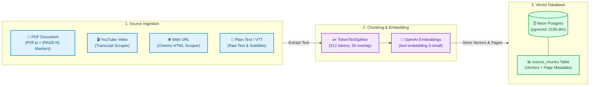
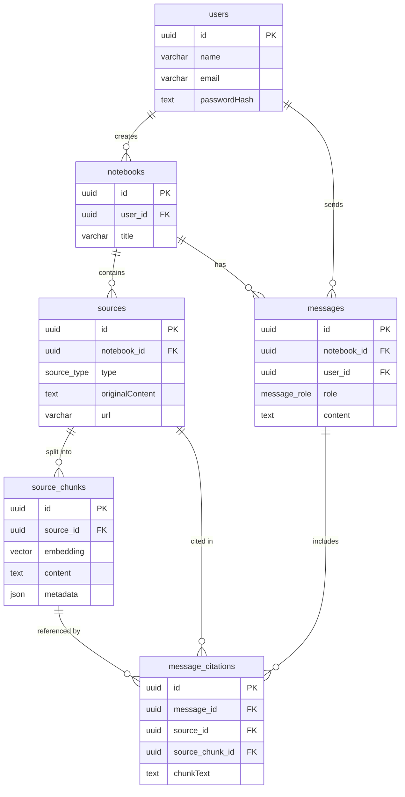

# SourceMind (ChaibookLM)

SourceMind is an AI-powered personal knowledge base and chat assistant, built heavily inspired by Google's NotebookLM. It allows users to upload various forms of unstructured data (PDFs, YouTube videos, web pages, plain text, and VTT transcripts), index them using a Retrieval-Augmented Generation (RAG) pipeline, and query them naturally using large language models.

---

## Tech Stack

### Frontend


- **Framework**: [Next.js](https://nextjs.org/) (App Router, React 19)
- **Styling**: [Tailwind CSS](https://tailwindcss.com/) v4 and [shadcn/ui](https://ui.shadcn.com/)
- **Icons**: [Lucide React](https://lucide.dev/)
- **Markdown Rendering**: `react-markdown` with `remark-gfm`

### Backend and Database


- **Database**: [Neon Postgres Serverless](https://neon.tech/) with the `pgvector` extension
- **ORM**: [Drizzle ORM](https://orm.drizzle.team/)
- **Authentication**: JWT-based custom authentication (bcryptjs, jsonwebtoken)

### AI and RAG Pipeline


- **Generative AI SDK**: [Vercel AI SDK](https://sdk.vercel.ai/docs) (`ai`, `@ai-sdk/openai`, `@ai-sdk/google`)
- **Embeddings**: OpenAI's `text-embedding-3-small` (1536 dimensions)
- **Chunking**: `@langchain/textsplitters` (`TokenTextSplitter` with `cl100k_base` encoding)
- **Data Loaders**:
  - `pdfjs-dist` (PDF parsing with page-level metadata tracking)
  - `youtube-transcript` (YouTube video transcripts)
  - `cheerio` (web page scraping)

---

## RAG Pipeline Strategy

To make the architecture easy to understand, the Retrieval-Augmented Generation (RAG) system is decoupled into two clean, directional workflows: **1. Ingestion & Indexing** and **2. Retrieval & Generation**.

---

### Phase 1: Ingestion & Indexing Pipeline
When a user uploads a source, the application extracts, chunks, and vectorizes the unstructured text before persisting it to the serverless vector database.



#### Step-by-Step Breakdown:
1. **Multi-Modal Text Extraction**:
   - **PDFs**: Client-side `pdfjs-dist` extracts text while injecting exact `[PAGE:N]` pagination markers so every paragraph retains page-level metadata.
   - **YouTube Videos**: `youtube-transcript` fetches video closed captions and merges them into a unified stream.
   - **Web URLs**: `cheerio` scrapes target webpages, stripping scripts, styles, and boilerplate HTML to isolate the core article body.
   - **Plain Text & VTT**: Ingested directly into the processing pipeline.
2. **Page-Bounded Chunking**:
   - Using LangChain's `TokenTextSplitter` (`cl100k_base` encoding), text is partitioned into semantically meaningful segments of **512 tokens** with a **50-token overlap**.
   - For PDFs, chunking is strictly bounded by page markers so that a single chunk never spans across multiple pages, guaranteeing precise citation tracking.
3. **High-Dimensional Vectorization**:
   - Each chunk is processed through OpenAI's `text-embedding-3-small` model to generate a **1536-dimensional vector embedding** capturing its semantic context.
4. **Serverless Vector Storage**:
   - Vectors, textual content, and pagination metadata (`pageNumber`, `chunkIndex`) are inserted into **Neon Postgres**. The database utilizes the `pgvector` extension with cosine distance indexing (`vector_cosine_ops`) for lightning-fast similarity lookups.

---

### Phase 2: Retrieval & Grounded Generation Pipeline
When a user asks a question inside a notebook, the application retrieves the most semantically relevant excerpts and streams back an accurately cited answer.


#### Step-by-Step Breakdown:
1. **Query Vectorization**:
   - The user's query is converted into a 1536-dimensional vector using the exact same `text-embedding-3-small` embedding model used during ingestion.
2. **Cosine Similarity Search**:
   - The backend executes a Drizzle ORM SQL query using `pgvector`'s cosine distance operator (`<=>`). It scans the `source_chunks` table for the target notebook and retrieves the **Top 5 most semantically relevant chunks** (`LIMIT 5`).
3. **Context Formatting & Guardrails**:
   - The retrieved excerpts are assembled into a structured context block: `--- Chunk [1] (Source: ...) ---`.
   - The system prompt enforces strict security guardrails: it prevents prompt injection, bans hallucination, forbids out-of-scope answers, and mandates citing sources using bracketed indices (`[1]`, `[2]`).
4. **Streaming Response & Citation Resolution**:
   - The **Vercel AI SDK** (`streamText`) streams the response from `gpt-4o` in real-time.
   - The backend encodes the matched chunk metadata into a custom HTTP header (`x-citations`), enabling the Next.js frontend to immediately render interactive citation badges and highlight exact page references as the answer streams in.

---

## Database Schema and Dependencies



---

## Folder Structure

```
.
├── app/
│   ├── api/                  # Next.js API Route Handlers (Backend)
│   │   ├── auth/             # Login, Signup, and Me routes
│   │   └── notebooks/        # Notebook CRUD, Sources, and Chat endpoints
│   ├── dashboard/            # Dashboard UI for managing notebooks
│   ├── login/                # Authentication pages
│   ├── signup/               # Authentication pages
│   └── notebook/[id]/        # Main workspace (Chat interface & Source Viewer)
├── components/
│   ├── notebook/             # Complex UI features (ChatPanel, SourceViewer, AddSourceDialog)
│   └── ui/                   # Reusable shadcn components
├── lib/
│   ├── ai/                   # RAG logic (chunker.ts, embedding.ts, loaders.ts)
│   ├── db/                   # Database connection and Drizzle schema (schema.ts)
│   ├── auth.ts               # JWT utilities
│   ├── store.tsx             # React Context for global state management
│   └── types.ts              # Global TypeScript interfaces
└── public/                   # Static assets (including pdf.worker.min.mjs)
```

---

## API Endpoints

### Authentication

- `POST /api/auth/signup` — Register a new user
- `POST /api/auth/login` — Authenticate and receive a JWT
- `GET /api/auth/me` — Validate token and get current user details

### Notebooks

- `GET /api/notebooks` — List all notebooks for the authenticated user
- `POST /api/notebooks` — Create a new notebook
- `GET /api/notebooks/[id]` — Get notebook details
- `DELETE /api/notebooks/[id]` — Delete a notebook

### Sources

- `GET /api/notebooks/[id]/sources` — List all uploaded sources in a notebook
- `POST /api/notebooks/[id]/sources` — Upload/ingest a new source (rate-limited to 5 per 24 hours). This triggers extraction, chunking, and vector indexing.

### Chat and Messaging

- `GET /api/notebooks/[id]/messages` — Fetch chat history for a notebook
- `POST /api/notebooks/[id]/chat` — Submit a user query, run vector similarity search, and stream back the LLM response with citations

---

## Setup and Development

1. **Install Dependencies**

   ```bash
   npm install
   ```

2. **Environment Variables**

   Create a `.env` file with the following variables:

   ```env
   DATABASE_URL="postgresql://[user]:[password]@[neon-host]/[dbname]?sslmode=require"
   JWT_SECRET="your-secret-key"
   OPENAI_API_KEY="sk-..."
   GOOGLE_GENERATIVE_AI_API_KEY="AIza..."
   ```

3. **Database Migration**

   ```bash
   npm run db:push
   ```

4. **Run Development Server**

   ```bash
   npm run dev
   ```

   Open `http://localhost:3000` to view the application.