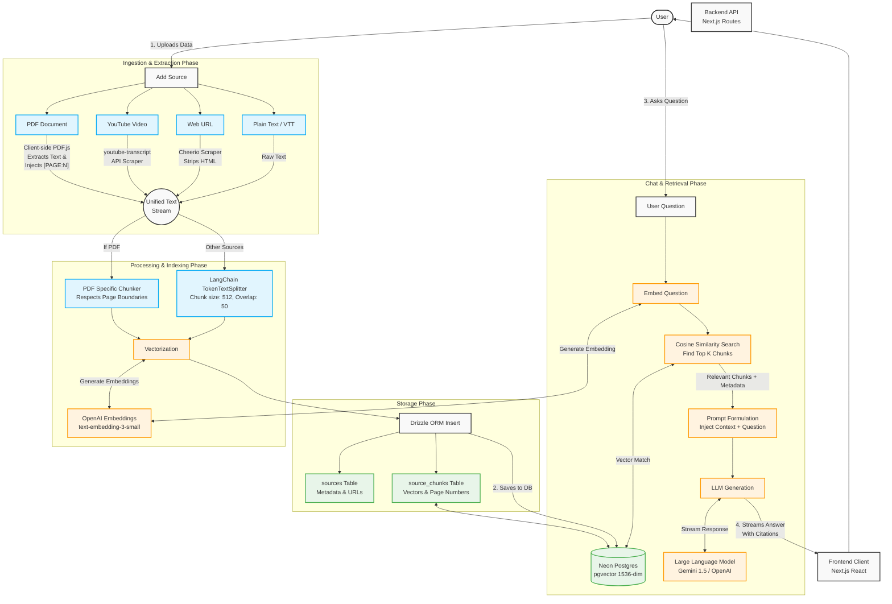
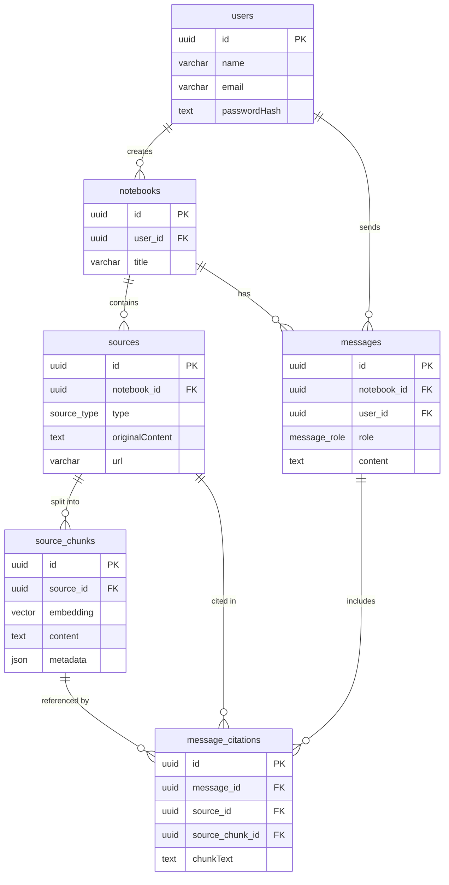

# SourceMind (ChaibookLM)

SourceMind is an AI-powered personal knowledge base and chat assistant built heavily inspired by Google's NotebookLM. It allows users to upload various forms of unstructured data (PDFs, YouTube videos, web pages, plain text, and VTT transcripts), index them using a RAG (Retrieval-Augmented Generation) pipeline, and query them naturally using large language models.

## 🚀 Tech Stack

### Frontend
- **Framework**: [Next.js](https://nextjs.org/) (App Router, React 19)
- **Styling**: [Tailwind CSS](https://tailwindcss.com/) v4 & [shadcn/ui](https://ui.shadcn.com/)
- **Icons**: [Lucide React](https://lucide.dev/)
- **Markdown Rendering**: `react-markdown` with `remark-gfm`

### Backend & Database
- **Database**: [Neon Postgres Serverless](https://neon.tech/) with `pgvector` extension
- **ORM**: [Drizzle ORM](https://orm.drizzle.team/)
- **Authentication**: JWT-based custom auth (bcryptjs, jsonwebtoken)

### AI & RAG Pipeline
- **Generative AI SDK**: [Vercel AI SDK](https://sdk.vercel.ai/docs) (`ai`, `@ai-sdk/openai`, `@ai-sdk/google`)
- **Embeddings**: OpenAI's `text-embedding-3-small` (1536 dimensions)
- **Chunking**: `@langchain/textsplitters` (`TokenTextSplitter` with `cl100k_base` encoding)
- **Data Loaders**:
  - `pdfjs-dist` (PDF parsing with page-level metadata tracking)
  - `youtube-transcript` (YouTube video transcripts)
  - `cheerio` (Web page scraping)

---

## 🧠 RAG Pipeline Strategy

The system uses an advanced Retrieval-Augmented Generation strategy to ground AI responses in the user's specific source materials:



### 1. Ingestion & Extraction
When a user adds a new source, the backend extracts the raw text content depending on the format. For PDFs, the frontend injects `[PAGE:N]` markers to preserve exact pagination metadata during the text extraction phase.

### 2. Chunking
Using Langchain's `TokenTextSplitter`, the extracted text is intelligently chunked into overlapping segments (e.g., 512 tokens with 50-token overlap) to preserve context. For PDFs, chunks are strictly bounded by page markers so that every chunk belongs to exactly one page, enabling accurate citation metrics.

### 3. Vector Embeddings
Each chunk is run through OpenAI's `text-embedding-3-small` model to generate a high-dimensional vector representation (1536 dimensions) of its semantic meaning.

### 4. Storage
Chunks, metadata (e.g., page numbers), and vector embeddings are stored in Neon Postgres. A vector index (HNSW) is applied over the `embedding` column using cosine similarity (`vector_cosine_ops`) to optimize semantic search performance.

### 5. Retrieval & Generation
When a user asks a question in a notebook, the question is transformed into a vector and searched against the database. The top *K* most relevant chunks are retrieved and injected into the LLM's system prompt. The model streams back its response and accurately cites the relevant chunks using inline markers (e.g., `[1]`, `[2]`), which the frontend resolves into interactive citation badges.

---

## 🗄️ Database Schema & Dependencies



---

## 📂 Folder Structure

```
.
├── app/
│   ├── api/                  # Next.js API Route Handlers (Backend)
│   │   ├── auth/             # Login, Signup, and Me routes
│   │   └── notebooks/        # Notebook CRUD, Sources, and Chat endpoints
│   ├── dashboard/            # Dashboard UI for managing notebooks
│   ├── login/                # Authentication pages
│   ├── signup/               # Authentication pages
│   └── notebook/[id]/        # Main workspace (Chat interface & Source Viewer)
├── components/
│   ├── notebook/             # Complex UI features (ChatPanel, SourceViewer, AddSourceDialog)
│   └── ui/                   # Reusable shadcn components
├── lib/
│   ├── ai/                   # RAG logic (chunker.ts, embedding.ts, loaders.ts)
│   ├── db/                   # Database connection and Drizzle schema (schema.ts)
│   ├── auth.ts               # JWT utilities
│   ├── store.tsx             # React Context for global state management
│   └── types.ts              # Global TypeScript interfaces
└── public/                   # Static assets (including pdf.worker.min.mjs)
```

---

## 🔌 API Endpoints

### Authentication
- `POST /api/auth/signup` - Register a new user
- `POST /api/auth/login` - Authenticate and receive a JWT
- `GET /api/auth/me` - Validate token and get current user details

### Notebooks
- `GET /api/notebooks` - List all notebooks for the authenticated user
- `POST /api/notebooks` - Create a new notebook
- `GET /api/notebooks/[id]` - Get notebook details
- `DELETE /api/notebooks/[id]` - Delete a notebook

### Sources
- `GET /api/notebooks/[id]/sources` - List all uploaded sources in a notebook
- `POST /api/notebooks/[id]/sources` - Upload/Ingest a new source (Rate-limited to 5 per 24 hours). This triggers extraction, chunking, and vector indexing.

### Chat & Messaging
- `GET /api/notebooks/[id]/messages` - Fetch chat history for a notebook
- `POST /api/notebooks/[id]/chat` - Submit a user query, run vector similarity search, and stream back the LLM response with citations

---

## 🛠️ Setup & Development

1. **Install Dependencies**
   ```bash
   npm install
   ```

2. **Environment Variables**
   Create a `.env` file with the following variables:
   ```env
   DATABASE_URL="postgresql://[user]:[password]@[neon-host]/[dbname]?sslmode=require"
   JWT_SECRET="your-secret-key"
   OPENAI_API_KEY="sk-..."
   GOOGLE_GENERATIVE_AI_API_KEY="AIza..."
   ```

3. **Database Migration**
   ```bash
   npm run db:push
   ```

4. **Run Development Server**
   ```bash
   npm run dev
   ```
   Open `http://localhost:3000` to view the application.
