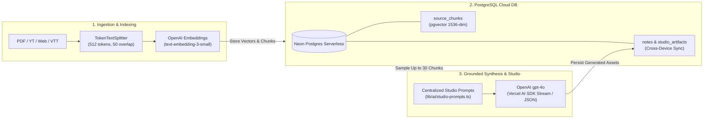
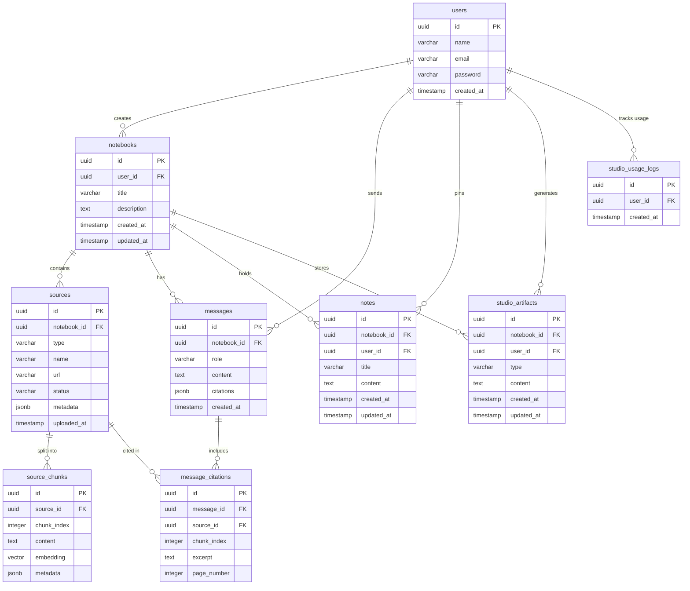

# SourceMind (ChaibookLM)

SourceMind is an enterprise-grade AI personal knowledge base, Notebook Studio, and grounded chat assistant, heavily inspired by Google's NotebookLM. It allows users to upload unstructured data (PDFs, YouTube videos, web pages, plain text, and VTT transcripts), index them via a multi-modal Retrieval-Augmented Generation (RAG) pipeline, synthesize interactive learning artifacts, and draft documents with real-time cloud synchronization.

---

## Key Features

### 1. Grounded AI Assistant with Interactive Citations
- **Semantic Retrieval**: Queries are vectorized and matched against high-dimensional embeddings using PostgreSQL pgvector.
- **Zero Hallucination Guardrails**: Strict refusal detection prevents citing sources when context is insufficient.
- **Interactive Citations**: Hovering or clicking bracketed citations ([1], [2]) highlights exact excerpts and page numbers in the split-screen source viewer.

### 2. Notebook Studio & AI Generators
Transform your unstructured sources into testable study aids and strategic briefings with a modular component architecture:
- **Interactive 3D Flashcards**: Flip animation deck with progress tracking ("Mastered" vs "Need Practice") and reshuffling controls.
- **Self-Assessment Quiz**: Multiple-choice interactive quiz player with instant visual feedback and comprehensive explanation reveals.
- **Study Guide & FAQ**: Auto-generates structured executive summaries, core definitions, and top FAQs.
- **Executive Briefing**: Synthesizes high-level strategic takeaways and actionable insights.
- **AI Credits Rate Limiting**: Built-in quota protection enforces a 10-item daily generation limit per user (resetting at midnight UTC) with a live usage counter and backend guardrails.

### 3. Pinned Notes & AI Drafting Assistant
- **Cloud-Synchronized Scratchpad**: Pin AI responses or create custom notes. Synchronized across devices via PostgreSQL and Drizzle ORM with optimistic local caching.
- **AI Drafting Assistant**: Select pinned notes and choose a drafting template (Blog Post, Analytical Report, Email Summary, or Custom Prompt) to synthesize polished documents.

---

## Tech Stack

### Frontend
- **Framework**: Next.js 16 (App Router, Turbopack, React 19)
- **Styling**: Tailwind CSS v4 & shadcn/ui
- **API Fetching**: Axios with custom JWT Bearer interception and optimistic local caching
- **Markdown & Code**: react-markdown with remark-gfm

### Backend and Database
- **Database**: Neon Postgres Serverless with pgvector
- **ORM**: Drizzle ORM
- **Authentication**: JWT-based custom authentication (bcryptjs, jsonwebtoken)

### AI and RAG Pipeline
- **Generative AI SDK**: Vercel AI SDK (ai, @ai-sdk/openai, @ai-sdk/google)
- **Embeddings**: OpenAI text-embedding-3-small (1536 dimensions)
- **Chunking**: @langchain/textsplitters (TokenTextSplitter with cl100k_base encoding)
- **Data Loaders**: pdfjs-dist, youtube-transcript, cheerio

---

## RAG & Studio Architecture



---

## Database Schemas and Relationships

All user profiles, notebooks, sources, vector chunks, notes, and studio artifacts are managed via relational tables in PostgreSQL using Drizzle ORM.

### Table Responsibilities
- **users**: Stores authentication credentials and user profile information.
- **notebooks**: Represents top-level research workspaces created by users.
- **sources**: Tracks uploaded documents, web URLs, and media transcripts within each notebook.
- **source_chunks**: Stores tokenized slices of text along with 1536-dimensional vector embeddings for cosine similarity search.
- **messages**: Preserves chat conversation history between the user and the grounded AI assistant.
- **message_citations**: Records exact source chunk associations, excerpts, and page numbers cited in AI responses.
- **notes**: Holds user-created scratchpad notes and AI-drafted documents, synchronized across devices.
- **studio_artifacts**: Persists generated study aids (flashcards, quizzes, study guides, briefings) in structured JSON or markdown format for offline and cross-device access.
- **studio_usage_logs**: Tracks daily AI generation timestamps per user to enforce OpenAI credit conservation rate limits (10 generations per day).

### Entity Relationship Diagram



---

## Folder Structure

```
.
├── app/
│   ├── api/                              # Next.js API Route Handlers (Backend)
│   │   ├── auth/                         # Authentication routes (login, signup, session validation)
│   │   └── notebooks/                    # Notebook management and workspace endpoints
│   │       ├── [id]/                     # Single notebook CRUD operations
│   │       ├── [id]/chat/                # Grounded RAG Chat & streaming citations
│   │       ├── [id]/messages/            # Chat history retrieval
│   │       ├── [id]/notes/               # Cloud-synchronized notes CRUD
│   │       │   └── [noteId]/             # Specific note update and deletion
│   │       ├── [id]/sources/             # Multi-modal source ingestion and vector indexing
│   │       │   └── [sourceId]/           # Source deletion and vector cleanup
│   │       └── [id]/studio/              # Studio generators and database persistence
│   ├── dashboard/                        # Dashboard UI for workspace management
│   ├── login/ & signup/                  # User authentication pages
│   └── notebook/[id]/                    # Main Workspace (Chat, Studio, Notes, Viewer tabs)
├── components/
│   ├── dashboard/                        # Dashboard components (notebook cards, creation dialogs)
│   ├── landing/                          # Landing page sections and navigation
│   ├── layout/                           # Global application headers and footers
│   ├── notebook/                         # Workspace UI components
│   │   ├── chat-panel.tsx                # Grounded Chat with auto-scroll and citations
│   │   ├── notes-panel.tsx               # Pinned notes scratchpad and AI drafting assistant
│   │   ├── source-viewer.tsx             # Split-screen highlighter and source inspector
│   │   ├── studio-panel.tsx              # Main studio controller and state manager
│   │   └── studio/                       # Modular Studio sub-components
│   │       ├── types.ts                  # Shared TypeScript interfaces (Flashcard, QuizQuestion)
│   │       ├── studio-hub.tsx            # Selection hub for generating study tools
│   │       ├── flashcard-viewer.tsx      # Interactive 3D flip-card deck and mastery progression
│   │       ├── quiz-viewer.tsx           # Self-assessment multiple-choice quiz player
│   │       └── document-viewer.tsx       # Markdown reader for Study Guides and Executive Briefings
│   └── ui/                               # Reusable shadcn/ui primitive components
├── lib/
│   ├── ai/                               # RAG and prompt engineering modules
│   │   ├── studio-prompts.ts             # Centralized prompt generator for Studio and drafting
│   │   ├── chunker.ts                    # LangChain token splitter configuration
│   │   └── loaders.ts                    # PDF, YouTube, and HTML scrapers
│   ├── db/                               # Neon Serverless connection and Drizzle ORM schema
│   ├── auth-context.tsx                  # React authentication state provider
│   ├── auth.ts                           # JWT token verification and header extraction
│   ├── notes-util.ts                     # Storage synchronization and optimistic local caching
│   └── store.tsx                         # Global React Context store (Axios integrated)
└── public/                               # Static assets (PDF.js worker, icons)
```

---

## API Routes and Responsibilities

### Authentication Routes
- `POST /api/auth/signup` — Registers a new user account, hashes credentials, and issues an authentication JWT.
- `POST /api/auth/login` — Authenticates user credentials and returns a JWT Bearer token and profile data.
- `GET /api/auth/me` — Validates the authorization header token and returns the current user session profile.

### Notebook Management Routes
- `GET /api/notebooks` — Retrieves all notebooks belonging to the authenticated user.
- `POST /api/notebooks` — Creates a new research notebook workspace.
- `GET /api/notebooks/[id]` — Fetches details and metadata for a specific notebook.
- `DELETE /api/notebooks/[id]` — Deletes a notebook along with all associated sources, chunks, notes, and studio artifacts.

### Source Ingestion and Indexing Routes
- `GET /api/notebooks/[id]/sources` — Lists all ingested sources and their indexing status for a notebook.
- `POST /api/notebooks/[id]/sources` — Ingests a multi-modal source (PDF, YouTube transcript, website URL, plain text, or VTT), chunks the content, generates OpenAI embeddings, and stores vectors in PostgreSQL.
- `DELETE /api/notebooks/[id]/sources/[sourceId]` — Removes a source and permanently purges its associated vector chunks from the database.

### Grounded Chat and Conversation Routes
- `POST /api/notebooks/[id]/chat` — Receives a user prompt, vectorizes the query, executes a cosine similarity search across source chunks, and streams the grounded OpenAI response with bracketed citation metadata.
- `GET /api/notebooks/[id]/messages` — Retrieves the historical chat log and associated citations for a notebook workspace.

### Notebook Studio Routes
- `GET /api/notebooks/[id]/studio` — Fetches all previously generated study tools (flashcard decks, quizzes, study guides, executive briefings) from PostgreSQL.
- `POST /api/notebooks/[id]/studio` — Aggregates up to 30 relevant document chunks, constructs specialized system prompts, invokes OpenAI gpt-4o to generate structured study aids, and persists the JSON/markdown output to the database.

### Cloud Notes and Drafting Routes
- `GET /api/notebooks/[id]/notes` — Retrieves all pinned notes and AI drafts for a notebook workspace.
- `POST /api/notebooks/[id]/notes` — Creates and persists a new user note or AI-synthesized document draft.
- `PATCH /api/notebooks/[id]/notes/[noteId]` — Updates the title or body text of an existing cloud note.
- `DELETE /api/notebooks/[id]/notes/[noteId]` — Deletes a specific pinned note from database storage.

---

## Setup and Development

1. **Install Dependencies**
   ```bash
   npm install
   ```

2. **Environment Variables**
   Create a `.env` file in the root directory:
   ```env
   DATABASE_URL="postgresql://[user]:[password]@[neon-host]/[dbname]?sslmode=require"
   JWT_SECRET="your-256-bit-secret-key"
   OPENAI_API_KEY="sk-..."
   GOOGLE_GENERATIVE_AI_API_KEY="AIza..."
   ```

3. **Database Migration**
   Push the Drizzle ORM schema (including vector indexes and studio tables) to Neon Postgres:
   ```bash
   npm run db:push
   ```

4. **Run Development Server**
   Start the Next.js 16 server in Turbopack mode:
   ```bash
   npm run dev
   ```
   Open `http://localhost:3000` to access SourceMind.